# Self Service EC2 Patch Management for multi-account organizations

# Table of Contents

- [Architecture Diagram](#architecture-diagram)
- [Deployment Instructions](#Deployment-Instructions)
    - [Prerequisites](#Prerequisites)
    - [Deployment Steps](#Deployment-Steps)
- [Resources](#Resources)
- [Usage](#Usage)
    - [Prerequisites](#Prerequisites)
    - [Steps](#Steps)
- [Patching Process](#Patching-Process)
    - [Normal Patching Process](#Normal-Patching-Process)
    - [Emergency Patching Process](#Emergency-Patching-Process)
- [Maintenance Window](#Maintenance-Window)
    - [Default Maintenance Window](#Default-Maintenance-Window)
    - [Custom Maintenance Window](#Custom-Maintenance-Window)
        - [Share Service Catalog Portfolio](#Share-Service-Catalog-Portfolio)
        - [Import Service Catalog Portfolio](#Import-Service-Catalog-Portfolio)
        - [Launch Service Catalog Product](#Launch-Service-Catalog-Product)
        - [Update Service Catalog Product](#update-Service-Catalog-Product)
        - [Delete Service Catalog Product](#delete-Service-Catalog-Product)
- [Exception-Management](#Exception-Management)
- [Tag-Monitoring](#Tag-Monitoring)
- [Compliance Reporting](#Compliance-Reporting)
    - [Athena Query](#Athena-Query)
    - [QuickSight Dashboard](#QuickSight-Dashboard)
- [Tear-down Instructions](#tear-down-instructions)
    - [Remove resources from the Child Accounts](#Remove-resources-from-the-Child-Accounts)
    - [Remove resources from the central Account](#Remove-resources-from-the-central-Account)
- [Referrences](#Referrences)
- [Pricing](#Pricing)


# Architecture Diagram


# Deployment Instructions

## Prerequisites
1.	AWS Organization setup
2.	AWS Config enabled in the child accounts
3.  Delegated Administrator account for CloudFormation (if you are using any other account than organization payer)

## Deployment Steps
1.	Clone the repository.
2.	Upload the zip versions of the .py files and patching_window.template file to a S3 bucket.
3.	Upload the patching-stack.yml file and deploy the CloudFormation template in master account
    1.	Provide a stack name.
    2.	Specify the bucket, where you have uploaded the code. it can be a new bucket or existing bucket, make sure to update the bucket policy as per the policy provided in bucket-policy.json file in the repository.
    3.	Specify the Organization id.
        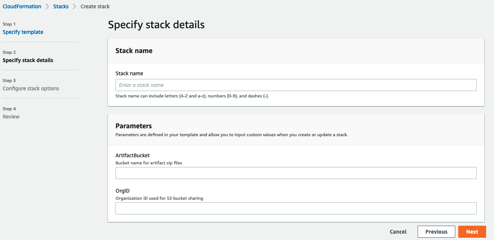
    4.	Click on Next
    5.	Hit Next and check “I acknowledge that AWS CloudFormation might create IAM resources with custom names”
    6.	Click on “Create Stack”.
4.  Deploy patching-stackset.yml in child accounts as stack or stackset
    1.	Enter a name for the StackSet.
        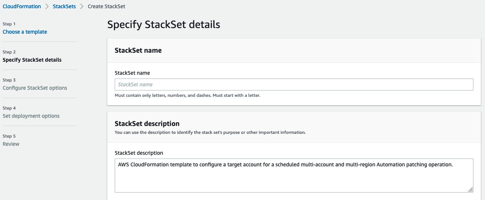
    2.	Navigate to the Outputs section of the stack launched in step-3 and fetch the below information.
        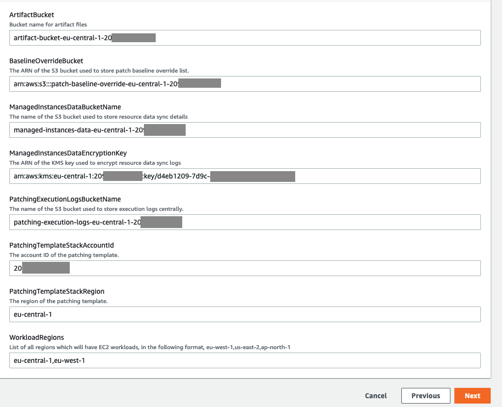
    3.  Specify the regions separated by comma, in which you have EC2 workload
    4.	Click Next
    5.	Click Next
    6.	Select Deployment target as “Deploy to organization”
        
    
    7.	Select all the regions you want to cover.
    8.	Click on Next.
    9.	Scroll down and select the check box “I acknowledge that AWS CloudFormation might create IAM resources with custom names”.
    10.	Click on Submit.

# Resources
There are two CloudFormation templatein the repository
1. patching-stack.yml to be deployed in the central account
    Resources created by this CloudFormation Template are listed below
    1. PatchingPortfolio: AWS Service Catalog Portfolio for patching
    2. AWS S3 Bucket for storing the managed instance inventory details
    3. AWS S3 Bucket for storing the patching execution logs from all the instances in the child accounts
    4. AWS S3 Bucket for storing patch list for InstallOverrideList functionality of Emergency patching
    5. AWS Customer managed keys for encrypting the S3 bucket
    6. AWS Glue database and crawler
    7. AWS Step function state machine and lambda function for Emergency Patching
    8. Amazon Athena Queries for extracting the compliance information

2. patching-stackset.yml to be deployed across all the child accounts within the organization
    Resources created by this CloudFormation Template are listed below
    1. Default Patch maintenance window 
    2. AWS Lambda function to carry out patching for standalone EC2 instances
    3. AWS Lambda function to carry out patching of EC2 instances part of an AutoScaling Group
    4. AWS Lambda function to initiate tagging for the relevant EC2 instance and AutoScaling Group
    5. AWS System manager automation document to orchestrate patching of standalone EC2 instances
    6. AWS System manager automation document to orchestrate patching of EC2 instances part of an AutoScaling Group
    7. AWS System manager Patch baselines for different OS such as Amazon Linux2, windows, ubuntu, RedHat.
    8. AWS System manager Resource data sync to collect inventory for managed instances and put it in central S3 bucket
    9. AWS Config rule for monitoring tags related to patching solution
    10. Amazon Event bridge rule to capture the tag non-compliance resulted from the config rule
    11. AWS lambda function to remediating tag non-compliance.

Note: You can navigate to Resources section in the deployed CloudFormation Template and check the exact names of the resources.

# Usage

## Prerequisites

1.	Active EC2 instances in the child accounts with Systems manager agent installed
2.	Instance profile having access to Systems manager and central S3 bucket attached to the EC2 instances.An Instance Profile *"InstanceProfileforPatching"* is being created as part of the automation in all the child accounts with necessary privileges.
3.	environment=<Dev/Test/Prod> tag attached to the instance based on the workload
4.	Share the service catalog in the central account across the organization.
5.  If you are using any AWS account other than Organization root account as Central account for patching, please make sure to configure the central account as delegated administrator for 
Account management: https://docs.aws.amazon.com/accounts/latest/reference/using-orgs-delegated-admin.html 
"Service Catalog": https://docs.aws.amazon.com/servicecatalog/latest/adminguide/catalogs_portfolios_sharing_how-to-share.html#portfolio-sharing-organizations 

## Steps

1.	Provide permission to the necessary entities to consume the Service Catalog portfolio in the child accounts.
2.	Launch the service catalog to create patch maintenance window.

# Patching Process
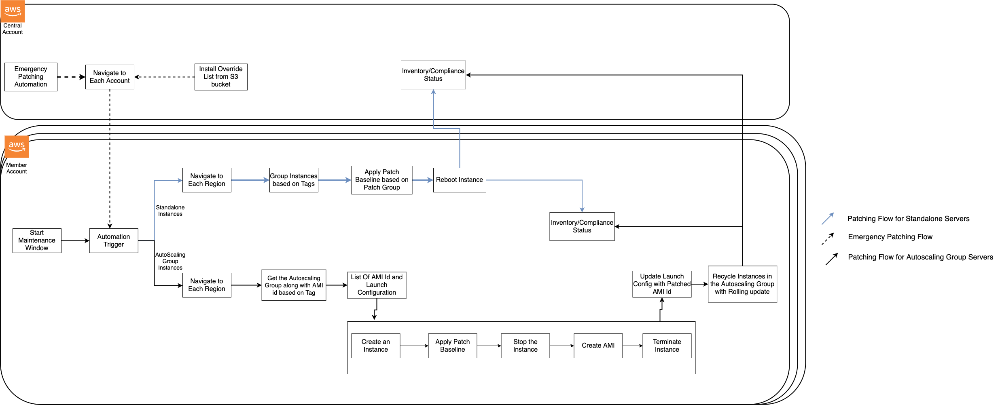

## Normal Patching Process

1.	Once the maintenance window starts in the designated schedule, it invokes the task lambda based on the target (Standalone Instance vs AutoScaling Group)
2.	The lambda function invokes the respective SSM automation document and provide all the necessary parameters.
3.	For Standalone Instance:
    1.	SSM Automation document navigates to each designated regions.
    2.	Applies AWS-RunPatchBaseline command to the instances with specific tags
    3.	Reboot the instances, if selected by the user as post patching operation
4.	For Instances part of AutoScaling Group:
    1.	SSM automation document navigates to each designated regions.
    2.	Get the Autoscaling group names based on certain tags.
    3.	Fetch the AMI id from the launch configuration/launch template.
    4.	Follow series of steps to generate a patched AMI
        1.	Create an intermediate instance from the AMI
        2.	Applied AWS-RunPatchBaseline to the instance
        3.	Stop the intermediate instance
        4.	Create AMI
        5.	Terminate the intermediate instance
    5.	Update launch configuration with the patched AMI.
    6.	Initiate Instance Refresh action based on the user input.
    7.	Wait for the instance refresh action to complete and scan the instances.

## Emergency Patching Process

There is an AWS Step function which provides the central team a platform to intervene the patching process and deploy ad-hoc patches in case of zero-day vulnerability fix or emergency patching situations.
1. Central platform/operation team member initiates the Emergency patching process by triggering the AWS Step function and provide necessary parameters like environment to target, resources and a S3 path style url specifying the external file in case of any ad-hoc patches using installOverrideList : https://docs.aws.amazon.com/systems-manager/latest/userguide/override-list-scenario.html 

Sample payload:
```
{
  "env": "Default",
  "include_asg": "Yes",
  "retain_healthy_percentage": 90,
  "refresh_asg_instances": "Yes",
  "patching_operation": "Install",
  "operation_post_patching": "RebootIfNeeded",
  "run_patch_baseline_install_override_list": ""                            
}
```
Detail description of the parameters have been mentioned in [Launch Service Catalog Product](#Launch-Service-Catalog-Product) section

2. The state machine triggers a lambda function in the central account which fetches the child account details in the organization, assumes a role into the child accounts and invokes the orchestrator lambda functions for patching.

Note: You can integrate a manual approval stage to the Step function as mentioned in the user guide doc: https://docs.aws.amazon.com/step-functions/latest/dg/tutorial-human-approval.html, AWS Step function will pause for an approval and proceed after the flow is approved.

# Maintenance Window

## Default Maintenance Window
This solution deploys a default maintenance window which covers the patching process for the instances which do not have any custom requirement for the patch maintenance window. The window triggers at every Friday 5:00AM UTC and installs patches by default in the standalone EC2 instance and EC2 instances part of AutoScaling Groups.

## Custom Maintenance Window
If there is a requirement for having a custom patch maintenance window, users can leverage service catalog product created as part of the implementation. 

### Share Service Catalog Portfolio
From the Central account follow the below steps to share the service catalog portfolio, if you are using an AWS account other than Organization root account than you may need to register the account as delegated administrator for AWS Service Catalog, more information on this can be found in the AWS Documentation: https://docs.aws.amazon.com/servicecatalog/latest/adminguide/catalogs_portfolios_sharing_how-to-share.html#portfolio-sharing-organizations 
Tip: AWS CLI command to register an account as delegated administrator for Service catalog
```
aws organizations register-delegated-administrator --account-id <provide-your-account-id> --service-principal servicecatalog.amazonaws.com
```
1.	Navigate to Service Catalog in the Central account
2.	Click on Portfolios and click on Patching portfolio
3.	Click on Share
    
4.	Select Organization Node and provide the Organization ID in the “Organization” Section.
5.	Enable Tag Option and click on Share
    

### Import Service Catalog Portfolio
In the child accounts, the servce catalog portfolio needs to be imported by the respective account/application owners.
1.	Navigate to Service Catalog in the correct region
2.	Click on Portfolios and Imported.
3.	Click on Patching portfolio
    
4.	Click on Group,roles and users
5.	Add groups,roles and users and select the relevant entity which you want to provide access to launch this product.
    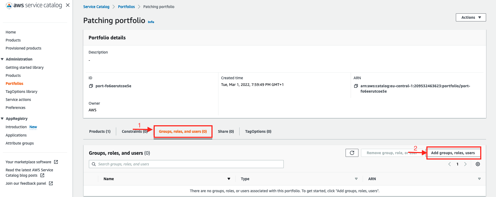

### Launch Service Catalog Product
1.	Navigate to Service Catalog and click on Products
    
2.	Click on Patching maintenance window product and click on Launch Product
3.  Provide a Suitable name to the product.
4.  Select the appropriate version
    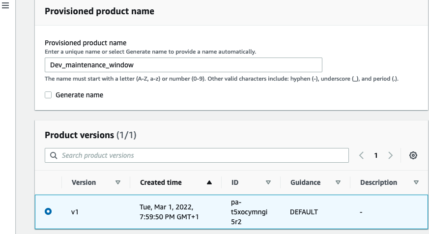
5.  Fill in the parameters details in the respective section.
    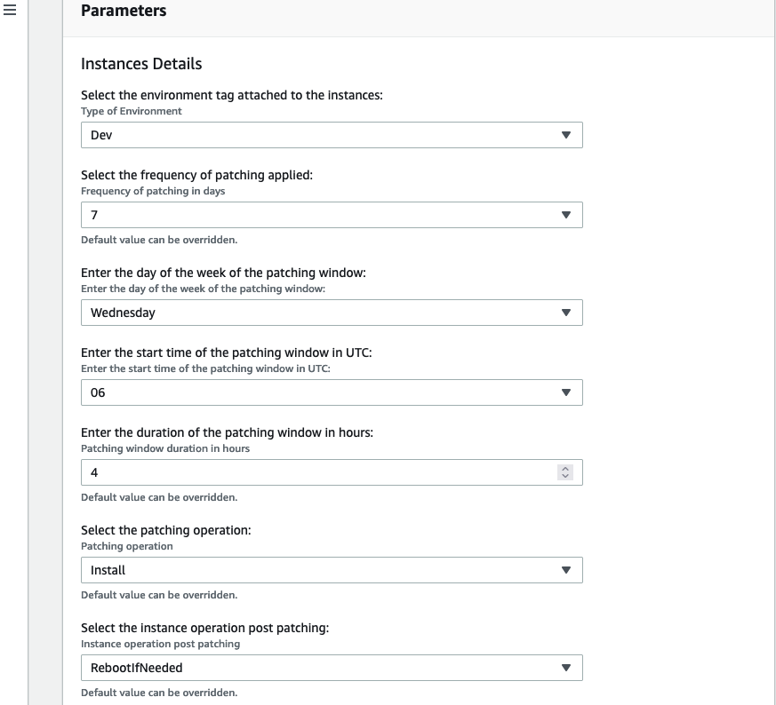
    1. **Select the environment tag attached to the instances**: Choose the environment you are targetting to patch with this maintenance window
       It can take values such as Dev,Test or Prod
    2. **Select the frequency of patching applied**: This represents the frequency of patching operation on your EC2 instances.Select from an enumerated list of frequency of    the patching window.
    3. **Enter the day of the week of the patching window**: Select the day of the week when you want the maintenance window to trigger
    4. **Enter the start time of the patching window**: Select the time at which you want the maintenance window to start
    5. **Enter the duation of the patching window in hours**: The duration of the maintenance window
    6. **Select the patching operation**:
       1. **Scan**: Systems manager scans your instances or non-compliant patches
       2. **Install**: AWS Systems manager scans your instances for non-compliant patches and installs the patches if found non-compliant.
    7. **Select the instance operation post patching**:
       1. **RebootIfNeeded**: Systems manager reboots the instance after installing the required patches, if it is needed.
       2. **NoReboot**: Systems manager will not reboot the instance after installing the required patches. If some patches requries reboot to finish installation, you need to make sure the instance is rebooted at your convinience to avoid non-compliance.
    The next section represents parameters for EC2 instances part of AutoScaling Group.

    8. **Select if to include AutoScaling Groups**:
       Select **'Yes'** if you want to include EC2 instances part of AutoScaling Group in this patching regime, else select *'No'*
    9. **Enter the percentage of remaining healthy instances during patching**:
       This option signifies the percentage of healthy instances you want to maintain at a time in the AutoScaling Group while the instance refresh action is being carried out by the patching automation.
    10. **Select if to refresh the instances in ASG after updating the launch configuration**:
       Select **'Yes'** if you want the automation to refresh your instances in the AutoScaling Group with instances launched from patched AMI, this takes consideration of the value you have provided in the previous parameter (percentage of remaining healthy instances during patching) and refreshes instances accordingly.
      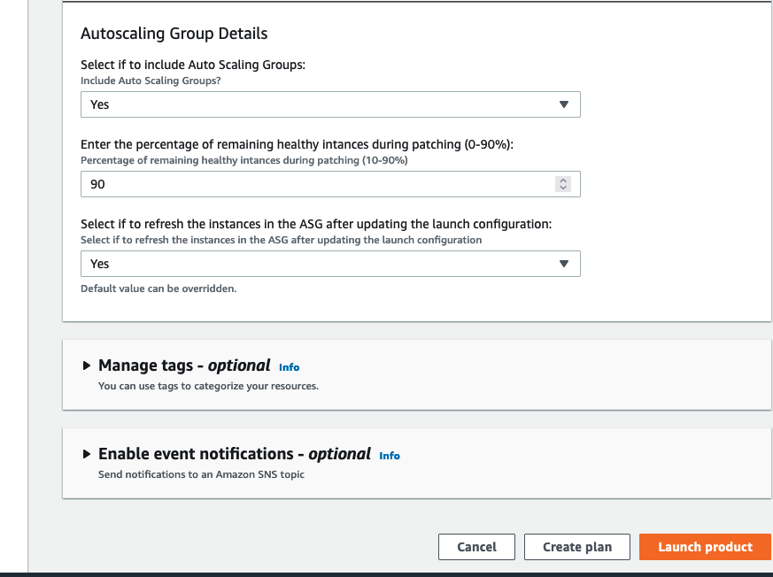
  6. Click on Launch Product.

  Note: The service catalog product will create a patch maintenance window in your account in the designated region and also trigger a tagging lambda function which will look for environment tag on your EC2 instances/AutoScaling Groups and put the patching tags on it accordingly. 

### Update Service Catalog Product
In case you want to update any inputs provided while creating the patch maintenance window, you can update the service catalog product and update the necessary parameters.
1. Navigate to Service Catalog and click on Provisioned products
2. Select your product and click on Actions
3. Click on Update
4. Update the required parameter and click on Update.

### Delete Service Catalog Product
In case you want to delete the patch maintenance window, follow the steps to perform the deletion
1. Navigate to Service Catalog and click on Provisioned products
2. Select your product and click on Actions
3. Click on terminate
4. Type in terminate and click on Terminate provisioned product.

**Note:** Deleting the service catalog product will delete the patch maintenance window and all the EC2 instances/AutoScaling groups covered by the patch maintenance window will be tagged with Default tags and the patch management will be covered under [Default Maintenance Window](#Default-Maintenance-Window)
If you do not want to patch any EC2 instance, follow the process outlined in [Exception-Management](#Exception-Management)

# Exception Management

This solution provides a way to exempt any EC2 instance or AutoScaling group from Patch management. You need to add an exception tag **'install_patch=no'** to the respective resources to exempt from the patching regime.
The automation will not create tags related to patching on those resources which has the exception tag.

# Tag-Monitoring


Based on the *environment* tag on the EC2 instance/AutoScaling group below patching tags will be applied.
1. Patch Group = <Default/Dev/Test/Prod>
2. maintenance_window = <Default/Dev/Test/Prod>_maintenance_window

**Note**: Default tags will be applied if the user forgets to apply right *environment* tag to the EC2 instance/AutoScaling Group based on the workload. the correspnding resource will be patched based on the enforced [Default Maintenance Window](#Default-Maintenance-Window).

An AWS config rule checks for the tag compliance in each of the child accounts. An Event bridge rule listens for compliance change and triggers lambda function. The lambda function does the following:

1. For EC2 instances:
    1. It checks for the Autoscaling tag key (aws:autoscaling:groupName), EKS tag key (Alpha.eksctl.io/nodegroup-name/ OR k8s.io/* OR kubernetes.io/*), ECS tag key (AmazonECSManaged), exception tag (patch_install=no)
    2. If any of the tags found, the lambda function does not perform any action.
    3. If none of the tags found, the lambda function verifies the environment tag, patch maintenance window and applies the patch tags accordingly.
2.	For AutoScaling Group:
    1. It checks for the EKS tag (k8s.io/cluster-autoscaler/enabled OR kubernetes.io/*), ECS tag (AmazonECSManaged) and exception tag (patch_install=no)
    2. If any of the tags found, the lambda function does not perform any action.
    3. If none of the tags found, the lambda function verifies the environment tag, patch maintenance window and applies the patch tags accordingly.


# Compliance Reporting

Individual child accounts can view patch compliance status of their EC2 workload in the Systems manager patch manager dashboard.
AWS resource data sync collects detailed inventory (https://docs.aws.amazon.com/systems-manager/latest/userguide/systems-manager-inventory.html) of the EC2 instances in the child accounts and sends to the central S3 bucket, which then can be consumed with services like AWS Glue, Amazon Athena and Amazon Quicksight to create compliance dashboards for the central team.

1. The State Manager Association triggers everyday to gather software inventory data.
2. The Inventory data is reported to Systems Manager.
3. The Resource Data Sync takes the Inventory data and sends to the central S3 bucket.
4. AWS Glue crawlers runs everyday to create the correct partition and schema.

## Athena Query

This solution deploys below Athena queries which will help customers extract the patch compliance information across different child accounts and various regions within it.

Saved Queries:

QueryNonCompliantPatch : Get the list of Non-Compliant Patches
QueryInstanceList : Get the list of instances across different accounts and regions.
PatchComplianceReport : Get list of compliant and non-complant patch inventory along with instance, account, region, platform details.

Steps:
1.	Navigate to Athena Console in the central account
2.	Select Saved queries and search for “PatchComplianceReport”
3.	Select the Database “managed_instances_database”.
4.	Click on Run


You can also download the report in csv format.

## QuickSight Dashboard

Amazon Quicksight helps you to visualize the data in dashboards.
You can create compliance dashboards in Quicksight to view the patch compliance status across your organization.
Steps: 
1.	Navigate to Quicksight
2.	Click on create Dataset
3.	Select Datasource as Athena
4.	Provide a Datasource name
5.	Click on Create Data source
6.	Choose the Database “managed_instances_database”
7.	Select patch_table
8.	Click on “Import to SPICE for quicker analytics”
9.	Click on Visualize
10.	Prepare the view
    1.	Select the Correct Dataset
    2.	Drag platformtype to X axis
    3.	Drag resourceid to Group/Color 
      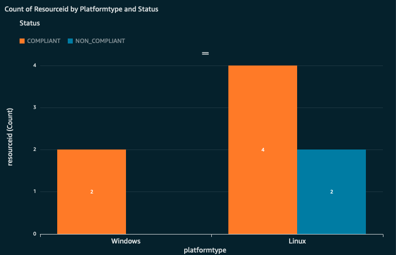

11.	Total managed instance count grouped by compliance status
    1.	Select Dataset as patch_table
    2.	Drag status to Group/Color
    3.	Select Donut Chart
      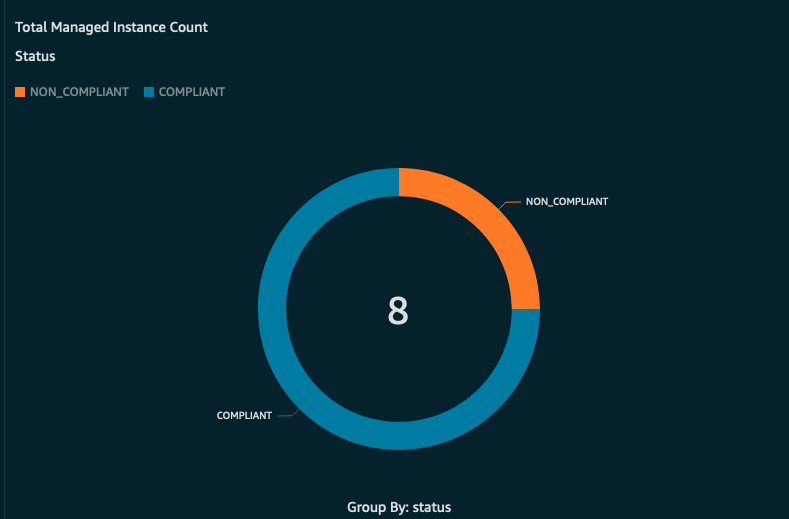

12.	Patch Compliance status grouped by account id.
    1.	Select Dataset as patch_table
    2.	Drag accountid to X axis
    3.	Drag status to Group/Color
      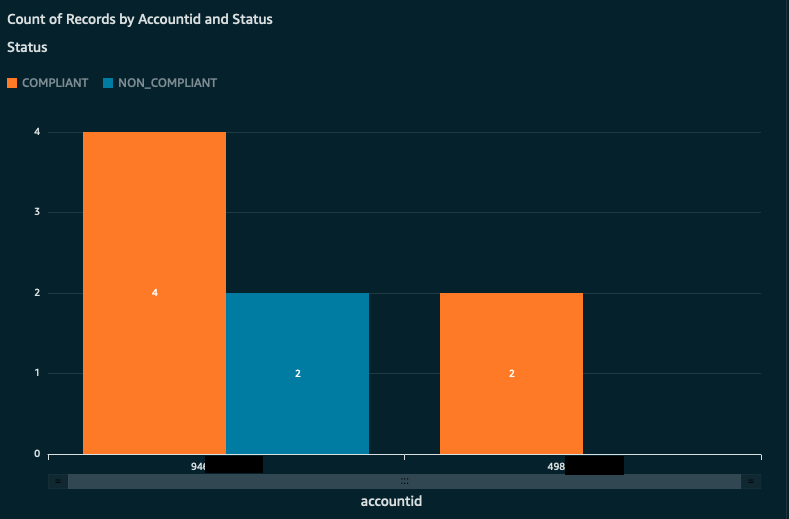

# Tear-Down Instructions

## Remove resources from the Child Accounts

1. In the Central account, Navigate to CloudFormation console.
2. Go to Stacksets
3. Search for the Stackset deployed for patching
4. Click on Actions
5. Delete Stacks from Stacksets
6. Provide AWS Organization Id
7. Specify the regions from which you want to delete the stacksets
8. Click Next and Click on Submit, this will delete the stacks from all the child accounts.
9. To delete the stackset, search for the stackset in the Central accout
10. Go to Action, delete stackset

## Remove resources from the central Account

1. In the central account, empty the S3 buckets created as part of the deployment.
   You can get the S3 bucket details from the resources section in the CloudFormations Stack
2. Navigate to CloudFormation console, Go to Stacks
3. Select the stacks related to patching
4. Click on delete

# Referrences:

[Centralized multi-account and multi-Region patching with AWS Systems Manager](https://aws.amazon.com/blogs/mt/centralized-multi-account-and-multi-region-patching-with-aws-systems-manager-automation/)

[About the SSM Document AWS-RunPatchBaseline](https://docs.aws.amazon.com/systems-manager/latest/userguide/patch-manager-about-aws-runpatchbaseline.html)

[Recording Software Configuration for Managed Instances](https://docs.aws.amazon.com/config/latest/developerguide/recording-managed-instance-inventory.html)

[Understanding AWS Systems Manager Inventory Metadata](https://aws.amazon.com/blogs/mt/understanding-aws-systems-manager-inventory-metadata/)

## Best Practice documentation:

[Amazon S3](https://docs.aws.amazon.com/AmazonS3/latest/userguide/security-best-practices.html)

[AWS Lambda](https://docs.aws.amazon.com/lambda/latest/dg/best-practices.html)

[AWS KMS](https://docs.aws.amazon.com/whitepapers/latest/kms-best-practices/key-policies.html )

# Pricing:

[AWS Systems Manager](https://aws.amazon.com/systems-manager/pricing/)

[AWS Glue](https://aws.amazon.com/glue/pricing/)

[Amazon Athena](https://aws.amazon.com/athena/pricing/)

[Amazon S3](https://aws.amazon.com/s3/pricing/)

[AWS Step Function](https://aws.amazon.com/step-functions/pricing/)

[Amazon CloudWatch](https://aws.amazon.com/cloudwatch/pricing/)

[Amazon QuickSight](https://aws.amazon.com/quicksight/pricing/)

[AWS Lambda](https://aws.amazon.com/lambda/pricing/)

[AWS Config](https://aws.amazon.com/config/pricing/)

[Amazon EventBridge](https://aws.amazon.com/eventbridge/pricing/)

[AWS Service Catalog](https://aws.amazon.com/servicecatalog/pricing/)


## Security

See [CONTRIBUTING](CONTRIBUTING.md#security-issue-notifications) for more information.

## License

This library is licensed under the MIT-0 License. See the LICENSE file.

